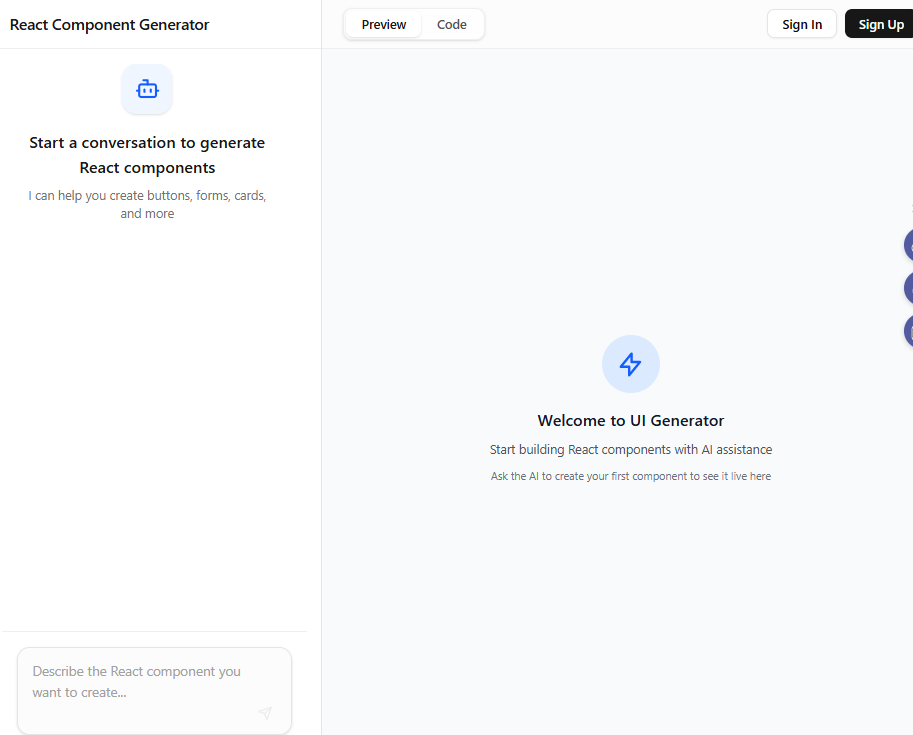
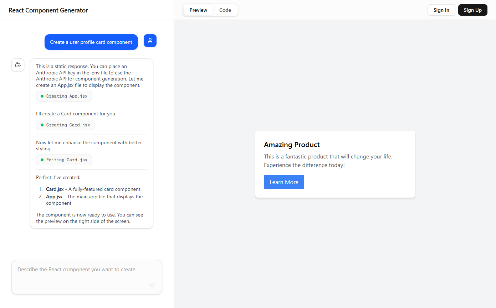
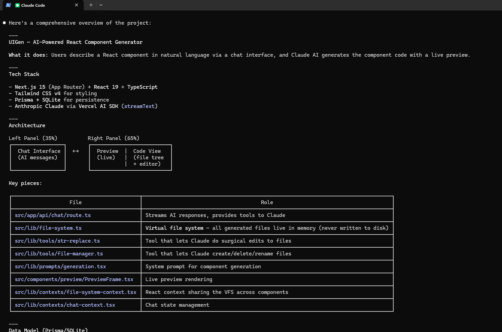
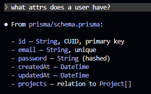
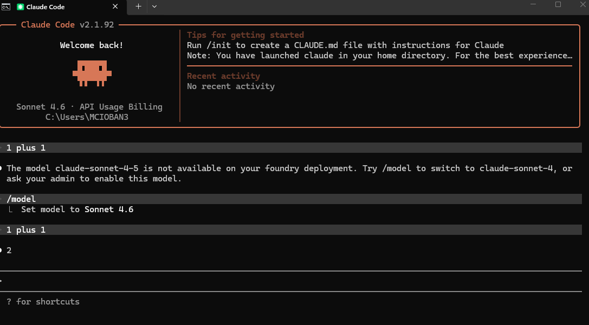
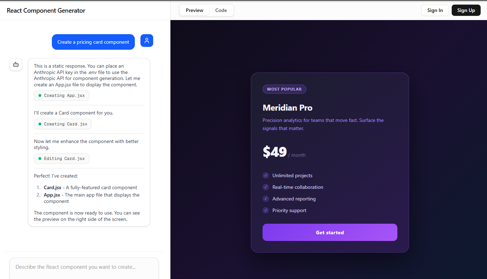
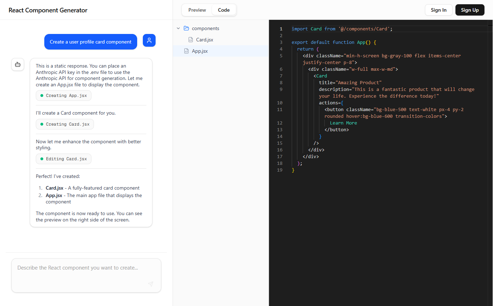
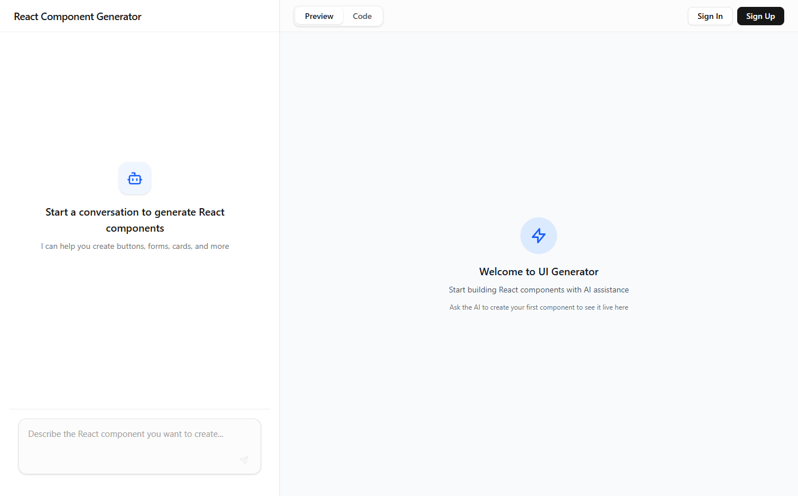

# Claude Code in Action — Course Projects

Two projects built while completing the **Claude Code in Action** course by Anthropic Academy. Both demonstrate how to use Claude Code for real-world development — from context management and custom commands to hooks and MCP servers.


---

## Projects

### 1. UIGen — AI-Powered React Component Generator (`commands/`)

A full-stack Next.js app where users describe React components in natural language and Claude generates them in real-time. Features a live preview, Monaco code editor, virtual file system, and JWT authentication.

**Tech:** Next.js 15 · React 19 · TypeScript · Tailwind CSS v4 · Prisma + SQLite · Anthropic Claude · Vercel AI SDK





**Claude Code topics demonstrated:**
- `CLAUDE.md` for context management
- Custom slash commands (`/audit`)
- MCP servers (Playwright browser automation)
- Plan Mode and Thinking Mode

---

### 2. E-Commerce Query Utilities (`queries/`)

A TypeScript + SQLite query library with 40+ parameterized functions across 8 domain modules — customers, products, orders, inventory, analytics, promotions, reviews, and shipping. Includes Claude Code hooks for duplicate query detection and TypeScript validation.

**Tech:** TypeScript 5.8 · SQLite3 · Anthropic Claude Agent SDK · Node.js


**Claude Code topics demonstrated:**
- Hooks (query duplication check, `.env` security, type checking)
- Task-driven development via `task.md`
- Agent SDK integration for code analysis

---

## Screenshots

| | |
|---|---|
|  |  |
|  |  |
|  |  |
|  |  |

---

## Course Topics Covered

- Core tools for file manipulation, command execution, and code analysis
- Context management with `/init`, `CLAUDE.md` files, and `@` mentions
- Conversation flow with hotkeys and commands
- Plan Mode and Thinking Mode for complex tasks
- Custom commands for automating repetitive workflows
- MCP servers for browser automation and external capabilities
- GitHub integration for automated PR reviews and issue handling
- Hooks for adding custom behavior into Claude Code

---

## Getting Started

```bash
# UIGen (commands/)
cd commands
npm run setup
npm run dev
# Open http://localhost:3000

# E-Commerce Queries (queries/)
cd queries
npm run setup
npx tsx src/main.ts
```

---

## Contact

**GitHub:** https://github.com/marius2347

**Email:** mariusc0023@gmail.com
