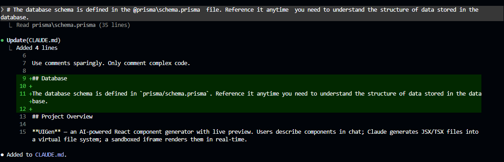
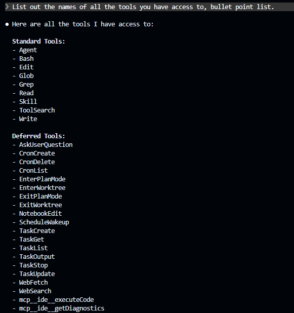
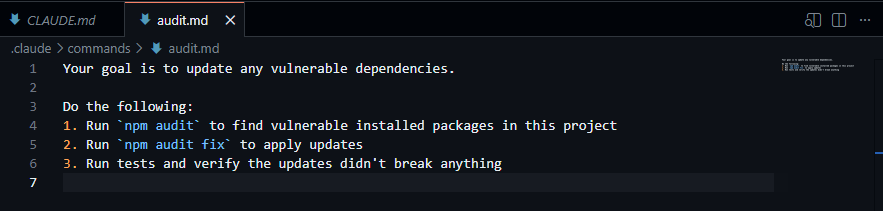
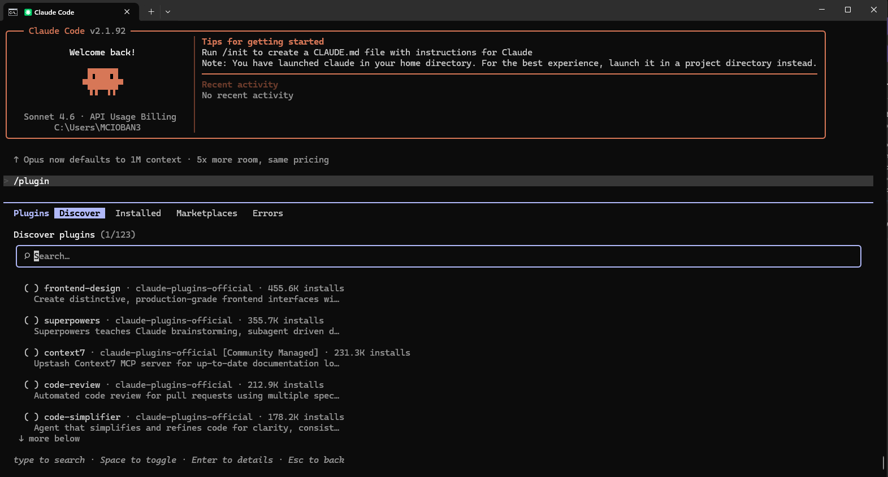

# E-Commerce Query Utilities

> Built as part of the **Claude Code in Action** course by Anthropic Academy.

A comprehensive TypeScript + SQLite query library for an e-commerce system. Provides 40+ parameterized query functions across 8 domain modules — covering customers, products, orders, inventory, analytics, promotions, reviews, and shipping.

---

## Features

- **40+ Query Functions** — Domain-specific modules for every aspect of e-commerce data
- **Parameterized Queries** — All queries use `?` placeholders to prevent SQL injection
- **Async/Promise-based** — Every function returns `Promise<T>` for async workflows
- **Rich TypeScript Interfaces** — Fully typed result structures for complex JOINs and aggregations
- **12-Table Schema** — Complete e-commerce data model (customers, products, orders, inventory, reviews, promotions, etc.)
- **Claude Code Hooks** — Duplicate query detection, `.env` security, and TypeScript type checking

---

## Tech Stack

| Layer | Technology |
|-------|------------|
| Language | TypeScript 5.8 |
| Database | SQLite3 via `sqlite` async wrapper |
| AI Integration | Anthropic Claude Agent SDK (used for code analysis hooks) |
| Runtime | Node.js with `tsx` |

---

## Database Schema

12 tables modeling a complete e-commerce system:

```
┌──────────────┐     ┌──────────────┐     ┌──────────────┐
│  customers   │────→│   orders     │────→│ order_items   │
│              │     │              │     │               │
│  addresses   │     │              │     └───────┬───────┘
│              │     └──────────────┘             │
│  customer_   │                                  │
│  segments    │     ┌──────────────┐     ┌───────▼───────┐
│              │     │  categories  │────→│   products    │
│  customer_   │     └──────────────┘     │               │
│  activity_log│                          │  inventory    │
└──────────────┘     ┌──────────────┐     │               │
                     │  warehouses  │────→│               │
                     └──────────────┘     └───────┬───────┘
                                                  │
                     ┌──────────────┐     ┌───────▼───────┐
                     │  promotions  │     │   reviews     │
                     └──────────────┘     └───────────────┘
```

| Table | Purpose |
|-------|---------|
| `customers` | User accounts with email, name, phone, status |
| `addresses` | Billing & shipping addresses |
| `categories` | Product categories with parent-child hierarchy |
| `products` | Product catalog with SKU, price, cost, weight |
| `inventory` | Stock levels by warehouse with reorder levels |
| `warehouses` | Distribution center locations |
| `orders` | Customer orders with status tracking (pending → delivered) |
| `order_items` | Line items within orders |
| `reviews` | Product reviews with ratings (1–5) and verification |
| `customer_segments` | Customer classification with lifecycle scores |
| `promotions` | Discount codes (percentage / fixed / free shipping) |
| `customer_activity_log` | Audit trail of customer actions |

---

## Query Modules

### `customer_queries.ts`
| Function | Description |
|----------|-------------|
| `getCustomerByEmail()` | Fetch customer with default shipping address & order history |
| `fetchActiveCustomers()` | Get customers with recent orders (customizable inactivity threshold) |
| `findCustomersBySegment()` | Query customers in a specific segment with lifetime value |
| `getCustomerProfile()` | Comprehensive profile: addresses, order count, last 5 products |
| `searchCustomersByName()` | Fuzzy search by first/last name with account age |
| `listCustomersWithReviews()` | Find customers who have written reviews |

### `product_queries.ts`
| Function | Description |
|----------|-------------|
| `getProductDetails()` | Fetch product with category, inventory, and average rating |
| `findProductsByCategory()` | List products with sales metrics by category |
| `getLowStockProducts()` | Alert for inventory below threshold |
| `fetchProductBySku()` | Look up product with warehouse quantities and sales velocity |
| `listAvailableProducts()` | Get active products with available inventory |
| `getProductsNeedingReorder()` | Identify products at reorder levels |

### `order_queries.ts`
| Function | Description |
|----------|-------------|
| `getOrderDetails()` | Full order with line items and customer contact info |
| `fetchCustomerOrders()` | Recent orders for a customer (paginated) |
| `getPendingOrders()` | Orders awaiting fulfillment with customer name/phone |
| `findOrdersByStatus()` | Query orders by status with product/warehouse info |
| `getRecentOrders()` | Orders from last N days with shipping method classification |
| `fetchOrdersByDateRange()` | Historical order queries with customer status |

### `inventory_queries.ts`
| Function | Description |
|----------|-------------|
| `getWarehouseInventory()` | All products in a warehouse with availability |
| `checkProductAvailability()` | Where a product is in stock across warehouses |
| `findStockTransfersNeeded()` | Rebalance inventory between warehouses |
| `getWarehouseInventoryValue()` | Calculate total inventory worth per location |
| `getReservedInventoryStatus()` | Track reserved stock for pending orders |
| `trackInventoryMovement()` | Monitor stock turnover and supplier info |

### `analytics_queries.ts`
| Function | Description |
|----------|-------------|
| `calculateCustomerLifetimeValue()` | CLV with preferred categories |
| `getSalesByCategory()` | Revenue, units sold, top products, segment breakdown |
| `getRepeatCustomerAnalysis()` | Identify loyal customers with order patterns |
| `getProductPerformance()` | Comprehensive metrics: sales, reviews, returns, segments |
| `getSegmentMetrics()` | Cohort analysis by customer segment |
| `getTrendingProducts()` | Growth rate comparison with new vs. repeat customer ratios |

### `promotion_queries.ts`
| Function | Description |
|----------|-------------|
| `getActivePromotions()` | Current campaigns with usage stats |
| `checkPromoEligibility()` | Determine if customer qualifies for a promotion |
| `getExpiringPromotions()` | Track campaigns ending soon with performance |
| `getPromotionPerformance()` | ROI analysis: gross revenue, discounts, net impact |
| `getUnusedPromotions()` | Identify campaigns not driving adoption |

### `review_queries.ts`
| Function | Description |
|----------|-------------|
| `getProductReviews()` | Reviews with verification badge & customer review count |
| `fetchCustomerReviews()` | All reviews written by a customer |
| `findUnverifiedReviews()` | Potential fraudulent reviews (no order link) |
| `getHelpfulReviews()` | Top-rated reviews with customer segmentation |
| `fetchRecentReviews()` | Recent reviews with inventory status & order total |

### `shipping_queries.ts`
| Function | Description |
|----------|-------------|
| `getShippingAddresses()` | Customer addresses with usage frequency |
| `findOrdersByDestination()` | Orders shipping to a state with delivery time metrics |
| `getUnshippedOrders()` | Orders not yet shipped |
| `getShippingCostByState()` | Shipping expense analysis |
| `findDeliveryDelays()` | Orders stuck in processing with customer segment |

---

## Project Structure

```
queries/
├── package.json
├── tsconfig.json
├── CLAUDE.md                 # Context file for Claude Code
├── task.md                   # Pending task: Slack integration for stale orders
├── sdk.ts                    # Claude Agent SDK configuration
├── src/
│   ├── main.ts               # Entry point: initializes DB schema
│   ├── schema.ts             # CREATE TABLE statements for all 12 tables
│   └── queries/              # 8 domain-specific query modules
├── hooks/
│   ├── query_hook.js          # Detects duplicate queries using Claude Agent SDK
│   ├── read_hook.js           # Security hook blocking .env file access
│   └── tsc.js                 # TypeScript type checking on file changes
└── scripts/
    └── init-claude.js         # Setup: creates .claude/settings.local.json
```

---

## Getting Started

```bash
# Install dependencies and initialize Claude settings
npm run setup

# Run the application (initializes DB and executes queries)
npx tsx src/main.ts
```

---

## Claude Code Hooks

This project uses Claude Code **hooks** — custom scripts that run automatically during development:

| Hook | Trigger | Purpose |
|------|---------|---------|
| `query_hook.js` | New query functions added | Uses Claude Agent SDK to analyze new queries and detect duplicates |
| `read_hook.js` | File reads | Blocks access to `.env` files for security |
| `tsc.js` | File changes | Runs TypeScript type checking |

---

## Claude Code Features Demonstrated

### CLAUDE.md for Context Management

The `CLAUDE.md` file gives Claude Code full awareness of the schema, project structure, and query patterns — enabling it to generate correct, non-duplicate queries.



### Hooks for Code Quality

Hooks automatically validate new code. The query hook prevents writing duplicate query functions by analyzing existing modules with the Claude Agent SDK:



### Custom Commands & Task-Driven Development

Claude Code reads `task.md` to understand pending work — like adding Slack integration for stale order alerts:



### Claude Code Interface

The Claude Code terminal UI with model selection and plugin discovery:



---

## Pending Task

> Add Slack integration to `main.ts`: check for orders pending > 3 days using `getPendingOrders()`, send alerts to `#order-alerts` with customer name and phone number. Runs as a daily cron job.

See `task.md` for full details.

---

## Course Reference

**Claude Code in Action** — Anthropic Academy

Topics covered: core tools, context management (`/init`, `CLAUDE.md`), conversation flow, Plan Mode, Thinking Mode, custom commands, MCP servers, GitHub integration, and hooks.

---

## Contact

**GitHub:** https://github.com/marius2347

**Email:** mariusc0023@gmail.com
